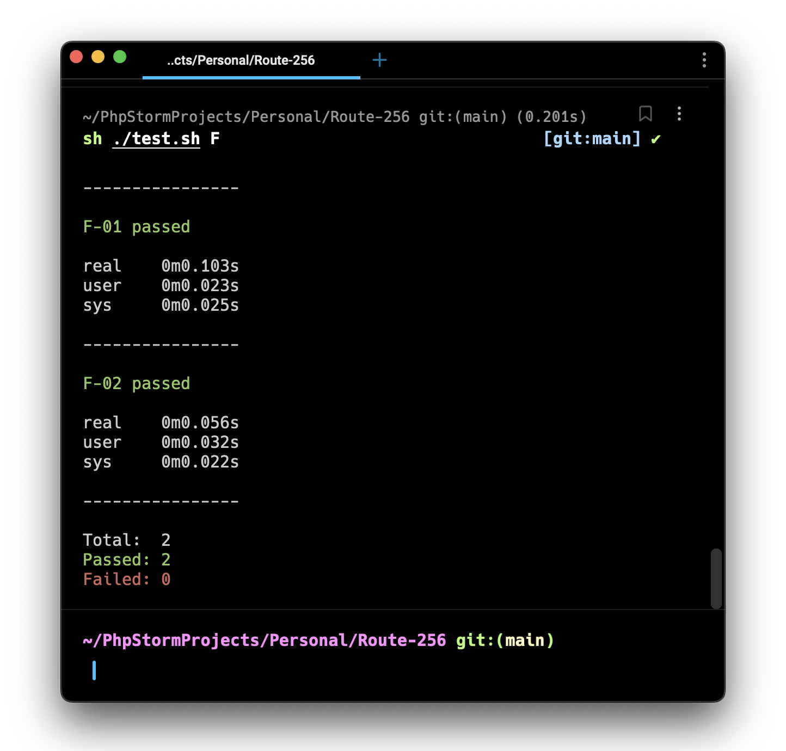

# Задачи основного контеста и варианты их решения - Route 256

Тексты заданий, тестовые данные и варианты решения на php в рамках соревнований https://route256.contest.codeforces.com/
>Контест - GO

## Тестирование
### Запуск всех семплов задания:
```bash
sh ./test.sh F
```
Пример результата:


### Запуск конкретного семпла задания:
```bash
sh ./test.sh F 01
```
Параметр F - индекс задания, 01 - используемый семпл.

При наличии проваленных тестов, разницу между эталонным и полученными ответами можно посмотреть в файле `*.diff` в директории соответствующего задания `./var/tmp/...`, например:
```
*** ./var/tmp/task-J/01.ans	2022-09-08 23:54:20.000000000 +0200
--- ./var/tmp/task-J/01.ref	2022-09-08 23:54:20.000000000 +0200
***************
*** 1,4 ****
! NO
  YES
  NO
  NO
--- 1,4 ----
! YES
  YES
  NO
  NO
```
